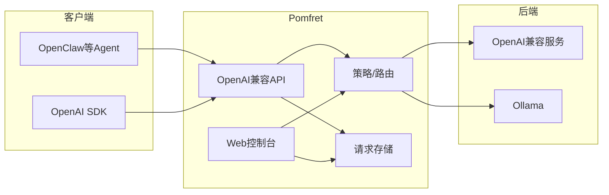

# Pomfret 设计文档

本文档描述 Pomfret（Proxy Of Models For Routing, Evaluation & Telemetry）的架构、技术选型与实现要点，便于后续维护与扩展。

---

## 架构概览



- **对外**：统一暴露 `https://gateway-host/v1/*`（OpenAI 兼容）。
- **对内**：路由层根据「当前选中的后端」将请求转发到对应 upstream，并可选地写入存储供控制台查看。

## 技术选型与约束

| 项目          | 选择                                     |
| ----------- | -------------------------------------- |
| 语言 / Web 框架 | Rust + Axum                            |
| 前端          | 原生 JavaScript，无框架，简洁可维护                |
| 静态资源        | `rust-embed` 或 `axum-embed`，编译期打进单一二进制 |
| 配置 / 状态     | 首版：内存（后端列表 + 当前选中），后续可加文件/DB           |
| 请求存储        | 内存队列 + 可选持久化（首版可仅内存，便于实现与测试）           |

## 项目结构

```
pomfret/
├── Cargo.toml
├── src/
│   ├── main.rs              # 入口、路由挂载、服务启动
│   ├── lib.rs                # 对外可测试接口
│   ├── config.rs             # 配置与后端列表
│   ├── proxy/
│   │   ├── mod.rs
│   │   ├── openai.rs         # OpenAI 兼容 API 处理（解析、转发、流式）
│   │   └── backends.rs       # 后端抽象：OpenAI 兼容 / Ollama 客户端
│   ├── store/
│   │   ├── mod.rs
│   │   └── memory.rs         # 请求/响应记录（用于控制台展示）
│   ├── web/
│   │   ├── mod.rs            # Web UI 路由与嵌入静态资源
│   │   └── api.rs            # 控制台用 API：列表请求、选择后端等
│   └── embed.rs              # 静态资源嵌入（若用 rust-embed）
├── static/                   # 前端源码（构建时或编译期嵌入）
├── tests/
│   ├── proxy_openai.rs       # 代理与流式解析测试
│   ├── backends.rs           # 后端客户端 mock/单元测试
│   └── store.rs              # 存储逻辑测试
```

- 所有对外「业务」逻辑放在库中（`lib.rs` + `mod`），便于从 `tests/` 和 `main.rs` 调用并写单元测试。

## 功能模块与实现要点

### 0. OpenAI 兼容 API（核心代理）

- **路径**：至少实现  
  - `POST /v1/chat/completions`（流式与非流式）  
  - `GET /v1/models`（可选，用于 OpenClaw 等拉模型列表）
- **实现要点**：从请求体解析 `model`、`messages`、`stream` 等；流式时按 SSE 原样转发、原样回写；使用 `reqwest` 流式 body；错误时返回与 OpenAI 格式一致的错误 JSON，并记录到 store。
- **兼容性**：Ollama 已支持 `/v1/chat/completions`，可与「OpenAI 兼容」后端共用同一转发逻辑；仅 base_url 和 api_key 不同。

### 1. Web 控制台：查看中转内容

- **页面**：`/` 或 `/console` 为控制台入口；`/console/requests` 为请求列表；点击某条进入详情（提示词、请求/响应 body、模型、耗时等）。
- **数据来源**：网关在代理层把「请求 + 响应（或摘要）」写入 store；控制台通过 `GET /api/requests`、`GET /api/requests/:id` 读内存 store。
- **实时更新**：控制台采用「长轮询 + 间隔兜底」保证列表与后端状态及时刷新。
  - **Long polling**：前端持续调用 `GET /api/notify?timeout=25`；服务端在有事件（新请求、后端变更）或超时后返回 `{ "events": ["requests"] | ["backends"] | ... }`，前端根据事件调用 `loadRequests()` / `loadBackendsAndStatus()` 后立即发起下一轮 notify；失败时 3 秒后重试。
  - **间隔兜底**：每 10 秒定时执行一次 `loadRequests()` 与 `loadBackendsAndStatus()`，在 notify 未触发或异常时仍能更新界面。
- **前端**：纯 JS + CSS，不引入 React/Vue 等框架。
- **多语言（i18n）**：控制台支持多语言，首版支持英文（默认）与简体中文。语言随系统环境选择：若浏览器语言为中文（`navigator.language` 或 `navigator.languages` 以 `zh` 开头）则使用简体中文，否则使用英文。实现方式：独立 `i18n.js` 维护文案表，页面静态文案通过 `data-i18n` 在 DOMContentLoaded 时替换，动态文案在业务 JS 中通过 `t(key)` 获取；保持实现简单、无额外构建。

### 2. 策略路由与「后端选择」

- **首版**：仅「当前选中的后端」。在 Web UI 提供后端选择页（如 `/console/settings`），选择结果写入内存状态；代理层读该状态决定转发到哪个 base_url。
- **后端配置**：维护后端列表（id、name、base_url、api_key、类型：openai_compat / ollama）。首版可从配置文件或环境变量加载。

### 3. 后端抽象与 Ollama / OpenAI 兼容

- **统一接口**：如 `BackendClient::chat_completions(request, stream) -> Response/Stream`。OpenAI 兼容与 Ollama 均用同一 HTTP 调用（`POST base_url/v1/chat/completions`），仅 base_url 和 Authorization header 不同。

## 工程要求

1. **Rust + Axum**：所有 HTTP 服务用 Axum；路由在 main 中挂载（`/v1/*` 给代理，`/api/*` 给控制台 API，`/` 或 `/console/*` 给静态与控制台页面）。
2. **可读性与注释**：每个 `mod` 和公开函数有简短文档注释；复杂分支加行内注释。
3. **单元测试**：proxy、backends、store 均有测试；每次迭代跑 `cargo test`，CI 必须通过。
4. **前端**：仅用原生 JS + 少量 CSS，避免大型框架。
5. **前端打包进二进制**：使用 `rust-embed` 将 `static/` 在编译期嵌入；`/console/*` 回退到 `index.html`，`/static/*` 从嵌入 map 取出并设置正确 Content-Type。

## 风险与注意事项

- **流式**：正确处理 SSE 边界和背压，避免内存暴涨；用 reqwest 流式 + Axum 的 StreamBody 或等价方式。
- **OpenClaw 兼容**：首版保证 `model`、`messages` 和流式响应即可，后续再补充 `tools`、`function_call` 等。
- **并发**：当前选中后端的读写要线程安全（`Arc<RwLock<>>` 或 `Arc<AtomicUsize>`），避免竞态。
